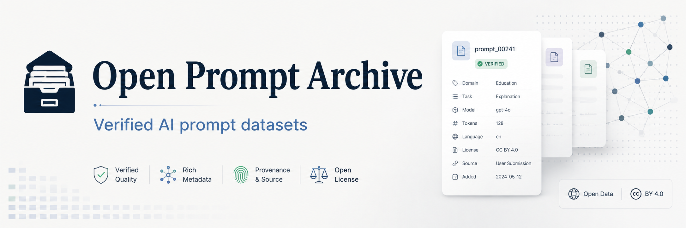
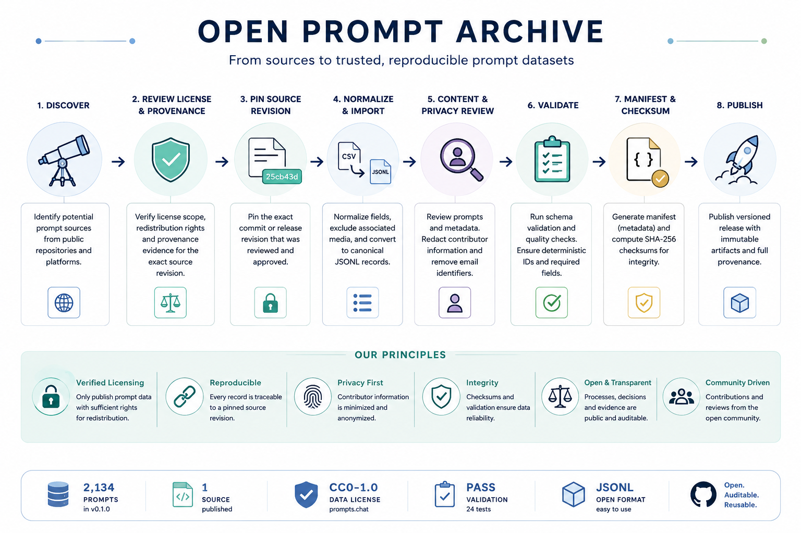

<p align="center">
  <strong>OPEN PROMPT ARCHIVE</strong>
</p>

<p align="center">
  <strong>Open AI prompt datasets with verified licensing, provenance, privacy review, and reproducible releases.</strong>
</p>

<p align="center">
  <a href="https://github.com/carnaverone/open-prompt-archive/releases/tag/dataset-v0.1.0"></a>
  
  
  
  
</p>

<p align="center">
  <a href="#-quick-start">Quick Start</a> ·
  <a href="data/sources/prompts-chat/part-00000.jsonl">Browse Data</a> ·
  <a href="https://github.com/carnaverone/open-prompt-archive/releases/tag/dataset-v0.1.0">Latest Release</a> ·
  <a href="DATASET_CARD.md">Dataset Card</a> ·
  <a href="sources/sources.yaml">Source Registry</a> ·
  <a href="CONTRIBUTING.md">Contribute</a>
</p>

<p align="center">
  
</p>

> [!CAUTION]
> The card fields shown inside this illustration are **decorative example metadata**, not canonical release metadata. Use the verified dataset facts, manifests, schemas, and source reviews in this repository for authoritative licensing and provenance information.

---

> [!IMPORTANT]
> **Publicly visible does not mean redistributable.** Open Prompt Archive publishes prompt data only after the relevant source scope, license basis, provenance, and publication artifact have been reviewed and verified.

## 📦 Dataset at a glance

| Metric | Current release |
|---|---:|
| Dataset version | **0.1.0** |
| Canonical prompts | **2,134** |
| Published sources | **1** |
| Current published source | `prompts.chat` |
| Effective data license | `CC0-1.0` |
| Format | `JSONL` |
| Canonical shard size | **7,736,751 bytes** |
| Canonical shard SHA-256 | `ba8377b874c621e44d8c9b321c1ef1f95d7565867186b5e5fb8c2f908402a77c` |
| Pending content review | **0** |
| Public contributor email identifiers | **0** |
| Publication validation | ✅ **PASS** |

**Release:** [`dataset-v0.1.0`](https://github.com/carnaverone/open-prompt-archive/releases/tag/dataset-v0.1.0)  
**Reviewed upstream revision:** `25cb43d6e61974e66f3650cbc5a65482bc592552`

---

## 🧭 How data becomes a release

<p align="center">
  
</p>

**Discover → verify license & provenance → pin source revision → normalize → review content & privacy → validate → manifest & checksum → publish**

Only an **approved source scope** can move into a published prompt snapshot.

---

## ⚡ Quick Start

### Download the current canonical shard

```bash
curl -L \
  https://raw.githubusercontent.com/carnaverone/open-prompt-archive/main/data/sources/prompts-chat/part-00000.jsonl \
  -o prompts.jsonl
```

### Inspect a record

```bash
head -n 1 prompts.jsonl | jq
```

### Read the dataset with Python

```python
import json

with open("prompts.jsonl", encoding="utf-8") as f:
    for line in f:
        record = json.loads(line)
        print(record["id"])
        print(record["prompt"])
        break
```

### Verify the published artifact

```bash
echo "ba8377b874c621e44d8c9b321c1ef1f95d7565867186b5e5fb8c2f908402a77c  prompts.jsonl" \
  | sha256sum --check
```

---

## 🔎 What makes this archive different?

| | Open Prompt Archive guarantees |
|---|---|
| 🛡️ **License scope** | Published records come only from source scopes with evidence-backed redistribution terms. |
| 🔗 **Provenance** | Records retain a traceable source identity and reviewed source revision. |
| 📌 **Pinned inputs** | Imports are tied to exact upstream revisions or snapshots. |
| 🧬 **Stable records** | Source-specific deterministic normalization and IDs make releases reproducible. |
| 🔐 **Privacy review** | Unnecessary contributor email identifiers are removed from public metadata. |
| ✅ **Validation** | Records, manifests, counts, byte sizes, and checksums are generated from real artifacts. |
| 🧾 **Auditability** | Human-readable reviews, machine-readable manifests, and source locks stay in the repository. |

> [!NOTE]
> Carnaverone Studio first-party, private, and proprietary prompt collections are intentionally excluded from this public archive.

---

## 🧩 What is in a record?

The canonical schema requires an ID, prompt, type, source, license, and provenance block. Optional fields can describe titles, models, tags, language, templates, and associated media.

```json
{
  "id": "prompts-chat:...",
  "prompt": "Preserved upstream prompt text...",
  "type": "llm",
  "source": {
    "source_id": "prompts-chat",
    "name": "prompts.chat",
    "url": "https://github.com/f/prompts.chat",
    "author": null,
    "revision": "25cb43d6e61974e66f3650cbc5a65482bc592552"
  },
  "license": {
    "spdx": "CC0-1.0",
    "attribution_required": false,
    "scope_verified": true
  },
  "provenance": {
    "retrieved_at": "2026-08-23",
    "verified": true,
    "modified": false
  }
}
```

See [`schema/prompt.schema.json`](schema/prompt.schema.json) and [`docs/DATA_MODEL.md`](docs/DATA_MODEL.md) for the complete contract.

---

## 📚 Source status

| Source | Archive state | Effective / claimed license | Published scope |
|---|---|---|---|
| [`prompts.chat`](sources/reviews/prompts-chat.md) | 🟢 **Published** | `CC0-1.0` | **2,134 prompt records** |
| [`DiffusionDB`](sources/reviews/diffusiondb.md) | 🟡 **Approved** | `CC0-1.0` | Prompt text + selected generation metadata; media excluded |
| [`BigScience PromptSource / P3`](sources/reviews/bigscience-promptsource.md) | 🟡 **Approved** | `Apache-2.0` | Prompt templates + prompt-specific metadata; underlying datasets excluded |
| [`Wuyoscar GPT-Image2-Skill`](sources/reviews/wuyoscar-gpt-image2-skill.md) | 🔵 **Review reopened** | `MIT` repository license | No prompt publication while provenance semantics are re-verified |
| [`freestylefly / awesome-gpt-image-2`](sources/reviews/freestylefly-awesome-gpt-image-2.md) | ⚪ **Quarantined** | `MIT` repository license | No bulk import; external/community provenance unresolved |
| YouMind collections | ⚪ **Quarantined** | `CC-BY-4.0` claimed upstream | No bulk import while license scope remains unresolved |

The canonical machine-readable registry is [`sources/sources.yaml`](sources/sources.yaml).

`Review` and `Quarantined` are curation states, not allegations about upstream projects. They indicate whether this archive currently has sufficient evidence to redistribute the intended prompt scope.

---

## 🤝 Contribute

Open Prompt Archive is **source-first, not prompt-dump-first**.

Useful contributions include:

- proposing a clearly licensed prompt source;
- providing stronger license or provenance evidence;
- identifying a mechanically verifiable open subset of a mixed-origin source;
- correcting attribution or provenance;
- reporting malformed or duplicate records;
- requesting removal or rights review;
- improving dataset tooling, schemas, or documentation.

Do **not** submit a copied prompt dump merely because it is publicly accessible.

**Start here:** [`CONTRIBUTING.md`](CONTRIBUTING.md)

---

## 📖 Documentation

| Need | Document |
|---|---|
| Dataset composition, limitations, intended use | [`DATASET_CARD.md`](DATASET_CARD.md) |
| Licensing rules | [`docs/LICENSING_POLICY.md`](docs/LICENSING_POLICY.md) |
| Provenance requirements | [`docs/PROVENANCE_POLICY.md`](docs/PROVENANCE_POLICY.md) |
| Source review workflow | [`docs/SOURCE_REVIEW_PROCESS.md`](docs/SOURCE_REVIEW_PROCESS.md) |
| Content review | [`docs/CONTENT_POLICY.md`](docs/CONTENT_POLICY.md) |
| Removal / rights review | [`docs/TAKEDOWN_POLICY.md`](docs/TAKEDOWN_POLICY.md) |
| Distribution architecture | [`docs/DISTRIBUTION_POLICY.md`](docs/DISTRIBUTION_POLICY.md) |
| Publication gates | [`docs/PUBLICATION_CHECKLIST.md`](docs/PUBLICATION_CHECKLIST.md) |
| Canonical data model | [`docs/DATA_MODEL.md`](docs/DATA_MODEL.md) |
| Notice and attribution | [`NOTICE.md`](NOTICE.md) |

---

<details>
<summary><strong>🎯 Scope</strong></summary>

### In scope

- Prompt datasets with explicit redistribution rights.
- Openly licensed repositories whose license scope covers the imported prompt content.
- Public-domain prompt collections with credible provenance.
- Evidence-backed subsets of mixed-origin repositories when eligibility can be determined reliably at record level.
- Source metadata, attribution, revision pins, license evidence, and review records.
- Normalized machine-readable prompt records.
- Licensing, provenance, attribution, and data-quality corrections.

### Out of scope

- Carnaverone Studio private or proprietary prompt collections.
- Blind scraping of prompt websites or social platforms.
- Publicly visible prompts with unknown redistribution rights.
- Paywalled, private, leaked, access-controlled, or credential-gated material.
- Third-party images, video, or audio unless independently rights-reviewed.
- Silent relicensing of upstream material.

</details>

<details>
<summary><strong>🧪 Curation and publication guarantees</strong></summary>

The publication path is intentionally stricter than simple source discovery:

1. identify a candidate source;
2. review license scope and provenance;
3. pin the exact reviewed source revision;
4. define a source-specific publication contract;
5. normalize without rewriting prompt semantics;
6. run content and privacy review;
7. validate every canonical record against the schema;
8. generate exact counts, byte sizes, manifests, and SHA-256 checksums;
9. publish an explicit dataset version.

A source can be **approved** without being **published**. Publication is a separate gate.

The first deterministic importer is [`scripts/import/prompts_chat.py`](scripts/import/prompts_chat.py).  
The pinned acquisition contract is [`data/sources/prompts-chat/source.lock.json`](data/sources/prompts-chat/source.lock.json).

</details>

<details>
<summary><strong>🗂️ Canonical data organization</strong></summary>

Prompt data is partitioned by source so licensing and provenance boundaries remain auditable.

```text
data/
└── sources/
    ├── prompts-chat/
    │   ├── README.md
    │   ├── source.lock.json
    │   ├── manifest.yaml
    │   └── part-00000.jsonl
    ├── diffusiondb/
    ├── bigscience-promptsource/
    └── wuyoscar-gpt-image2-skill/
```

Source-specific directories define the reviewed revision, eligible scope, field mapping, exclusions, license handling, and publication gates.

Derived formats such as Parquet, SQLite/FTS, or search indexes may be added later, but they do not replace the canonical source/provenance model.

</details>

<details>
<summary><strong>⚖️ Licensing model</strong></summary>

Open Prompt Archive is intentionally **multi-license at the data layer**.

- Repository-authored software, schemas, templates, and documentation use the root [`LICENSE`](LICENSE) unless stated otherwise.
- Imported prompt data retains its effective upstream license.
- Attribution and notice obligations remain attached to the relevant records.
- An aggregator's software license is not automatically treated as a license for externally sourced prompt content.
- Record-level or subset-level approval is preferred for mixed-origin sources.
- Associated media is excluded by default unless independently reviewed.
- SPDX identifiers are used where practical.
- Repository-authored files use REUSE-compatible metadata.

See [`NOTICE.md`](NOTICE.md), [`REUSE.toml`](REUSE.toml), and [`docs/LICENSING_POLICY.md`](docs/LICENSING_POLICY.md).

</details>

<details>
<summary><strong>📦 Distribution strategy</strong></summary>

Small, reviewable text datasets may be tracked directly in Git as deterministic JSONL shards.

Very large datasets use:

- Git-tracked manifests;
- reviewed source revisions;
- checksums and compact metadata;
- immutable versioned release assets.

This keeps normal clones practical while preserving reproducibility.

See [`docs/DISTRIBUTION_POLICY.md`](docs/DISTRIBUTION_POLICY.md).

</details>

<details>
<summary><strong>🏗️ Repository structure</strong></summary>

```text
open-prompt-archive/
├── README.md
├── DATASET_CARD.md
├── CITATION.cff
├── CONTRIBUTING.md
├── CHANGELOG.md
├── LICENSE
├── NOTICE.md
├── REUSE.toml
├── data/                  # canonical published/source-partitioned data
├── sources/               # source registry + human reviews
├── schema/                # machine-readable contracts
├── scripts/               # deterministic curation tooling
├── tests/                 # curation contract tests
├── docs/                  # policies, guides, visual assets
└── .github/               # contribution and repository configuration
```

</details>

<details>
<summary><strong>🏛️ Governance and responsible reuse</strong></summary>

Open Prompt Archive uses lightweight maintainer-led governance. Maintainers review evidence, approve source scopes, publish snapshots, and handle corrections/removals.

An open license on prompt text does not automatically resolve model terms, trademarks, privacy, publicity rights, personal data, or rights in linked media.

Open Prompt Archive records licensing and provenance evidence for dataset governance; it does not provide legal advice.

See [`GOVERNANCE.md`](GOVERNANCE.md).

</details>

---

## 🧾 Citation

For research, evaluation, tooling, or downstream datasets, use [`CITATION.cff`](CITATION.cff).

Individual upstream attribution obligations still apply to reused records where required.

---

## Maintainer

Maintained by **Carnaverone Studio**.
